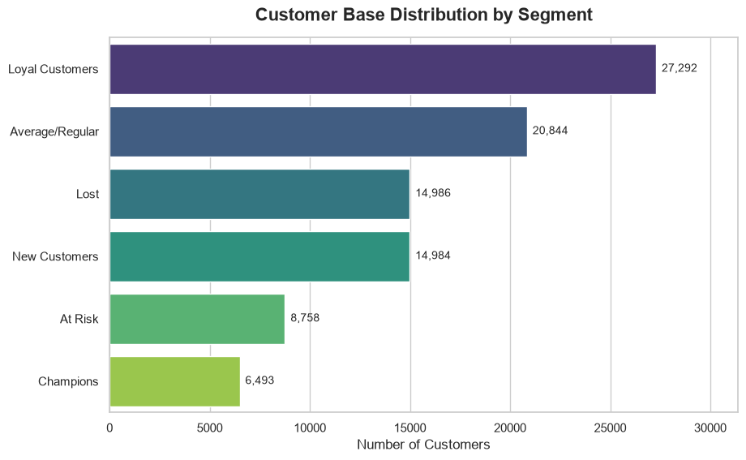
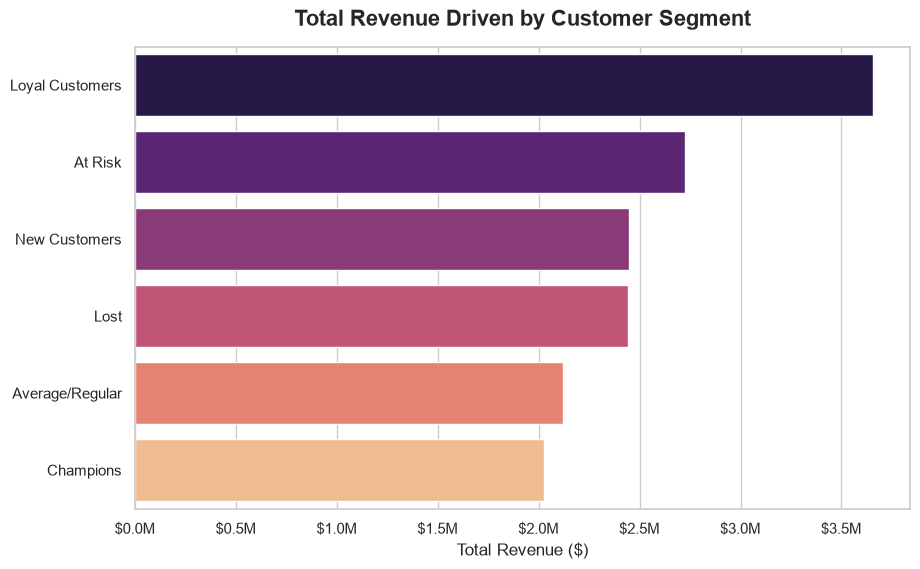
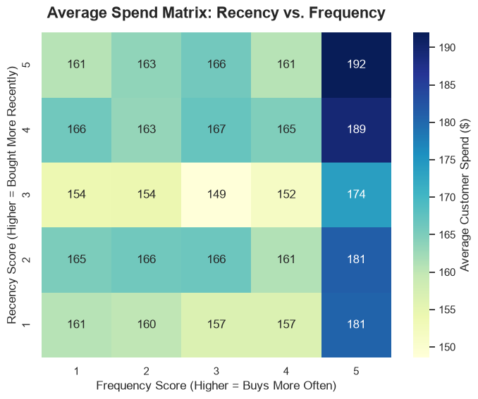

# 📊 E-Commerce Customer Segmentation & RFM Analysis

## 🎯 Project Objective
The goal of this project is to transform raw, multi-table transactional data into actionable business intelligence. By engineering an automated ELT pipeline and applying an **RFM (Recency, Frequency, Monetary)** model, this project segments over 99,000 e-commerce customers into distinct behavioral cohorts to optimize targeted marketing and reduce churn.

## 🛠️ Tech Stack
* **Data Engineering (ELT):** Python (`sqlalchemy`, `pandas`), MySQL
* **Data Analysis & Extraction:** Advanced SQL (CTEs, Window Functions, Multi-table JOINs)
* **Data Visualization:** Python (`matplotlib`, `seaborn`)
* **Environment:** Jupyter Notebook

## ⚙️ Methodology & Pipeline Architecture

### 1. The ELT Pipeline (Extract, Load, Transform)
Instead of relying on flat CSVs, I engineered a Python script to ingest raw data from the Brazilian E-Commerce Public Dataset (Olist) and load it into a relational **MySQL** database. This architecture enforces data integrity across 9 interconnected dimension and fact tables.

### 2. SQL Data Extraction
To analyze repeat purchasing behavior, I wrote a master SQL query using **Common Table Expressions (CTEs)** and **Window Functions** (`ROW_NUMBER()`) to aggregate total payments and track chronological order history per unique customer.

### 3. RFM Customer Segmentation (Python/Pandas)
Using the extracted master table, I calculated three core metrics for each customer:
* **Recency:** Days since their last purchase.
* **Frequency:** Total number of orders placed.
* **Monetary:** Total lifetime spend.

Customers were scored from 1 to 5 across these metrics using quantile bucketing (`pd.qcut`) and categorized into business-driven segments: *Champions, Loyal Customers, At Risk, Recent/New Customers,* and *Hibernating/Lost*.

---

## 📈 Key Business Insights

### 1. Revenue by Segment
  
* **Insight:** The **"Champions"** cohort makes up only **7.0 %** of the total customer base, but drives **$2,026,656.84** in total revenue. 
* **Actionable Recommendation:** Shift marketing spend away from broad acquisition and focus on VIP loyalty programs for this specific cohort to maximize ROI.

### 2. The Customer Base Distribution
  
* **Insight:** We have **8,758** customers currently sitting in the **"At Risk"** segment. These are users who used to spend heavily and frequently but have not made a purchase in recent months.
* **Actionable Recommendation:** Deploy aggressive win-back email campaigns with targeted discount codes exclusively to this segment to prevent high-value churn.

### 3. Executive Spend Matrix (Recency vs. Frequency)
  
* **Insight:** As expected, average order value strongly correlates with both recency and frequency, proving the validity of the RFM model for this dataset.

---

## 🚀 How to Run this Project
1. Clone this repository to your local machine.
2. Install the required dependencies: `pip install pandas sqlalchemy pymysql matplotlib seaborn`
3. Ensure you have a local instance of MySQL running. Update the connection string credentials in the first cell of the notebook.
4. Run the `Olist_RFM_Analysis.ipynb` notebook from top to bottom. The script features built-in exception handling to safely skip the database insertion phase if the MySQL database is already populated.
